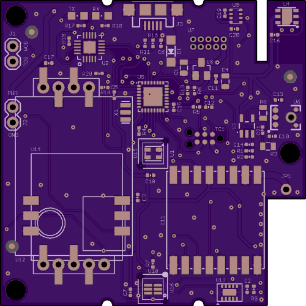

# Open Source Indoor Air Quality Sensor
An open hardware and software indoor air quality sensor provided by the [National Association of REALTORS](http://realtor.org) and [CRT Labs](https://crtlabs.org) in collaboration with the [Built Environment Research Group](http://built-envi.com/) at Illinois Institute of Technology.

**Features**:
* Can measure upto 8 indoor environmental quality parameters (listed below)
* Atmel ATmega328P 16MHz 8-bit processor (based on Arduino platform)
* Genuine FTDI chip for serial communication with host computer
* Mini RGB LED for status and notification
* Programmable button for custom actions such as reset, configuration, etc.
* Long range wireless data transfer using FSK radio (no dependence on WiFi, cellular, etc.)
* Small footprint PCB board (less than 2x2 inches or 50x50mm)
* Low power requirements (35mA idle with all sensors running, 190mA peak during wireless data transfer)

**Measurement Points**:
* Temperature (Si7021)
* Relative Humidity (Si7021)
* VOC (Volatile Organic Compounds) (CCS811/IAQ-Core)
* CO2 (MH-z19)
* Particulate Matter, PM2.5 (PMS7003)
* Barometric Pressure (BMP280)
* Light Intensity (TSL2591)
* Sound Intensity (Electret Microphone)

**Connectivity**:
* FSK radio (RFM69HW 915MHz)
* MicroUSB (FTDI FX231XQ)

License:
Apache License Version 2.0

For the Raspberry Pi HAT, please visit the [PiAQ Website](http://piaq.io) and [repository](https://github.com/NationalAssociationOfRealtors/PiAQ)
